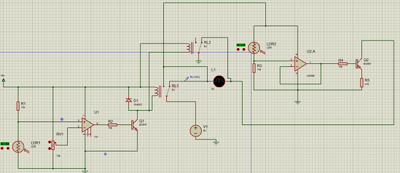
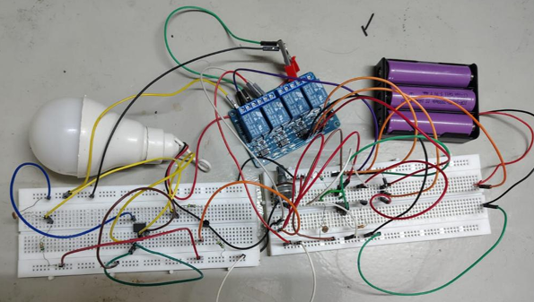
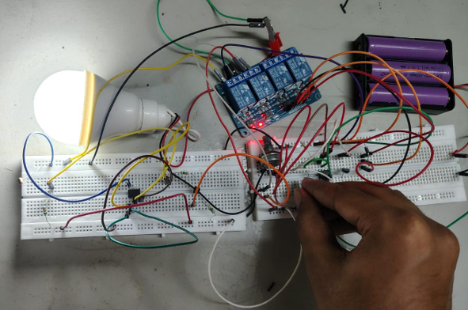
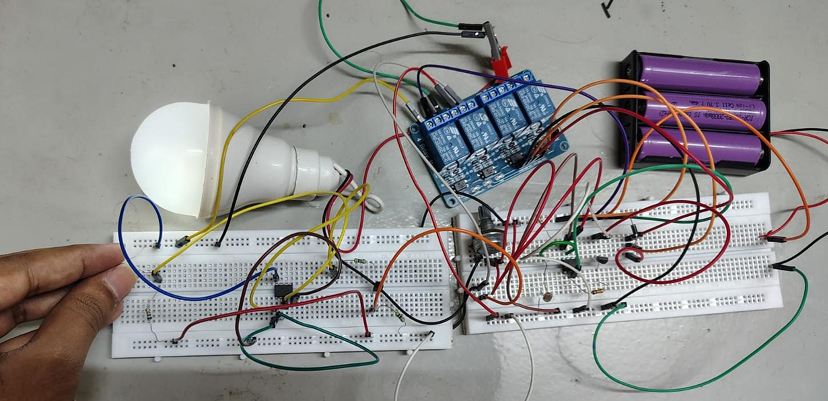

## 💡 LDR-Based Automatic Ambient Light Control System

# 📌 Overview

This project presents an automatic ambient light sensing and lighting
control system designed for residential lighting applications.

The system uses Light Dependent Resistors (LDRs) to detect changes in
ambient light intensity. The sensed signal is processed using
operational amplifiers configured as comparators, which compare the
sensor voltage against adjustable reference levels.

Based on the comparator output, transistor switching stages control the
lighting load through relay-based and solid-state switching.

# 🎯 Objectives

- Design an automatic lighting control system for residential applications
- Detect ambient light intensity using LDR sensors
- Automatically switch the lighting load according to ambient conditions
- Provide adjustable light-level thresholds
- Demonstrate sensor-based analog signal processing and switching
- Reduce unnecessary manual operation and power consumption

# ⚙️ Working Principle

The system continuously monitors ambient light intensity using LDR
sensors.

The LDR converts changes in light intensity into corresponding voltage
changes through a resistive voltage-divider circuit. The sensor voltage
is then compared with an adjustable reference voltage using an
operational amplifier configured as a comparator.

The comparator output drives a transistor switching stage. In the
primary stage, the transistor controls a relay that switches the
lighting load.

The overall operating sequence is:

```text
Ambient Light
      ↓
   LDR Sensor
      ↓
Voltage Divider
      ↓
Op-Amp Comparator
      ↓
Transistor Switching
      ↓
Relay / Load Control
      ↓
Automatic Lighting
```
# 🔌 Circuit Architecture

The system consists of two independent sensing and control stages.

Stage 1 — LDR1 / LM741 / Relay Control

The first stage uses an LDR and resistor network to generate a
light-dependent voltage. An LM741 operational amplifier compares this
voltage with an adjustable reference provided by a potentiometer.

The comparator output drives an NPN transistor, which energizes a relay
to control the lighting load.

A protection diode is connected across the relay coil to protect the
switching transistor from the inductive voltage generated when the
relay is switched off.

Stage 2 — LDR2 / LM358 / Transistor Control

The second stage uses another LDR-based voltage divider and an LM358
operational amplifier.

Its output directly controls a PNP transistor, providing an auxiliary
solid-state switching output without using a relay.

This provides an independent light-level threshold for additional
control or staged response

# 🖼️ Circuit Diagram



# 🧩 Components Used
```
| Component      | Specification                         |
| -------------- | ------------------------------------- |
| R1, R2, R3, R4 | 10 kΩ                                 |
| R5             | 470 Ω                                 |
| U1             | LM741 Op-Amp                          |
| U2             | LM358 Op-Amp                          |
| Light Sensors  | LDR × 2                               |
| Q1             | BC547 NPN Transistor                  |
| Q2             | BC557 PNP Transistor                  |
| D1             | 1N4007                                |
| Power Supply   | 12 V                                  |
| Bulb           | 12 V                                  |
| Relay          | 5 V nominal, 70 Ω internal resistance |
```

# 🔄 Operating Conditions
```
| Ambient Condition | System Output      |
| ----------------- | ------------------ |
| Daylight          | Light OFF          |
| Darkness          | Light ON           |
| Dim Light         | Light ON partially |
```

## 🛠️ Hardware Implementation

The circuit was implemented on a breadboard and tested under different
ambient lighting conditions.

# Daylight



# Complete Darkness



# Optimal Darkness



## 📊 System Workflow|
```
Sense Ambient Light
        ↓
Convert Light Level to Voltage
        ↓
Compare with Adjustable Threshold
        ↓
Generate Switching Signal
        ↓
Drive Transistor
        ↓
Control Relay / Auxiliary Output
        ↓
Switch Lighting Load
```

## 📁 Repository Structure
```
ldr-op-amp-based-automatic-ambient-light-control/
│
├── images/
│   ├── circuit-diagram.png
│   ├── complete-darkness.png
│   ├── daylight.png
│   └── optimal-darkness.png
│
├── report/
│   └── project-report.pdf
│
└── README.md
```
## 📄 Project Report

The complete project report is available here:

[View Project Report](report/project-report.pdf)

## 🏁 Conclusion

The project demonstrates an automatic lighting control system based on
ambient light sensing.

By combining LDR sensors, operational-amplifier comparators,
transistor switching, and relay-based load control, the system can
automatically respond to changes in environmental lighting conditions.

The hardware implementation demonstrates the intended operation under
different lighting conditions.
